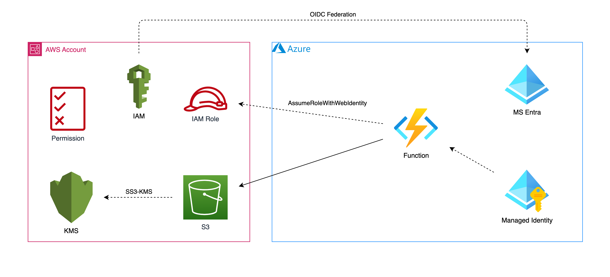
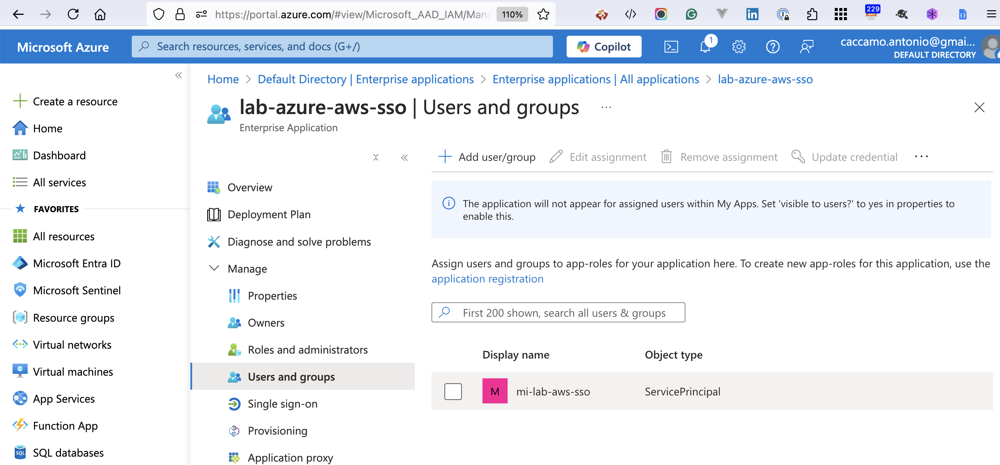
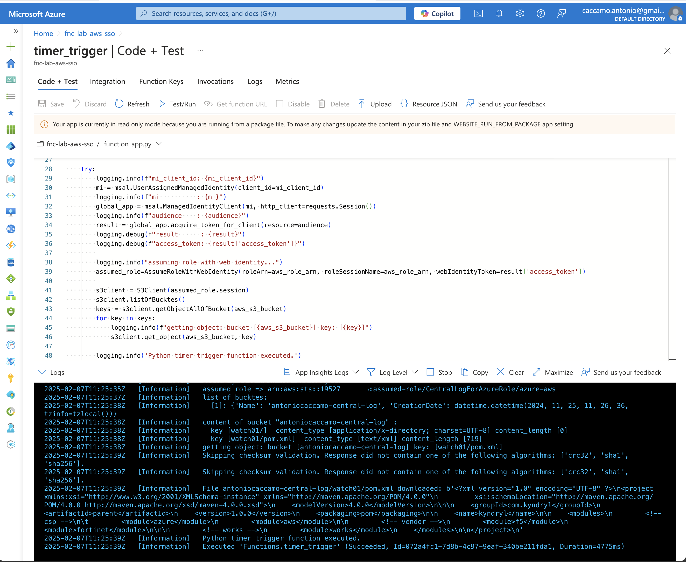
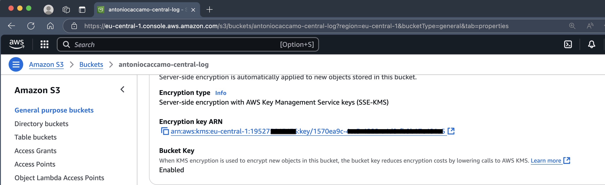
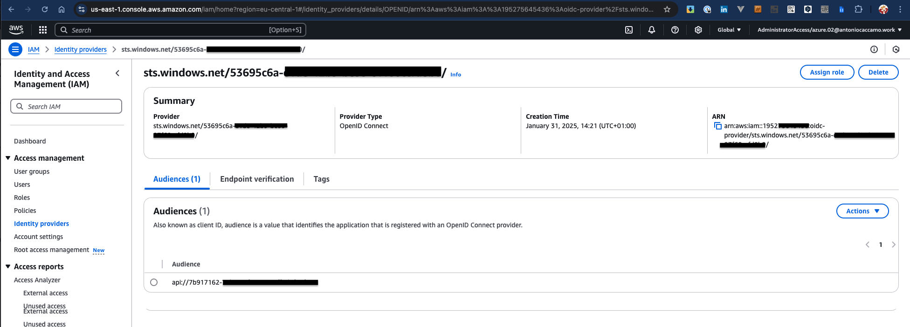
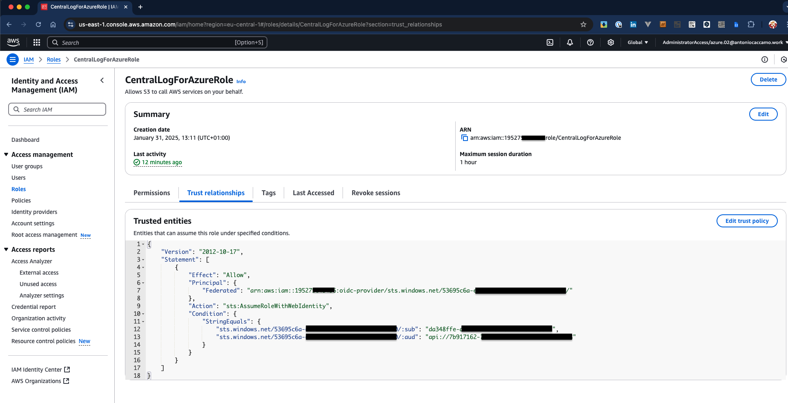

= lab-azure-aws-sso
:sectlinks:
:sectanchors:
:sectids:
:sectnums: 
:toc: auto

[no]
== Introduction
This solution try to address how to access an AWS S3 bucket, with SSE-KMS encryption, from an Azure function.

.Azure cloud resources access AWS resources with temporary security credentials

This project provides:

1. the terraform scripts to build basic Azure infrastructure

2. the bash script to link:./scripts/app.roles.assignments.sh[assign managed identity to application]

3. the link:./fnc-lab-aws-sso/function_app.py[Azure function] that, after assume role with web identity, access to the encrypted S3 and read blobs

4. link:./.github/workflows/main_fnc-lab-aws-sso.yml[GitHub action] to build and deploy the Azure function (with Github federation too :smiley:)

## Azure

.Enterprice App with Managed Identity assignment

.Azure function
[]

## AWS

.S3 bucket

### OIDC Federation

.AWS IAM identity Provider

.AWS IAM Role trust policy

link:./script/app.roles.assignments.sh[assign managed identity to application]

link:./terraform/README.md[terraform]

== Reference
* https://aws.amazon.com/it/blogs/security/how-to-access-aws-resources-from-microsoft-entra-id-tenants-using-aws-security-token-service/[How to access AWS resources from Microsoft Entra ID tenants using AWS Security Token Service]