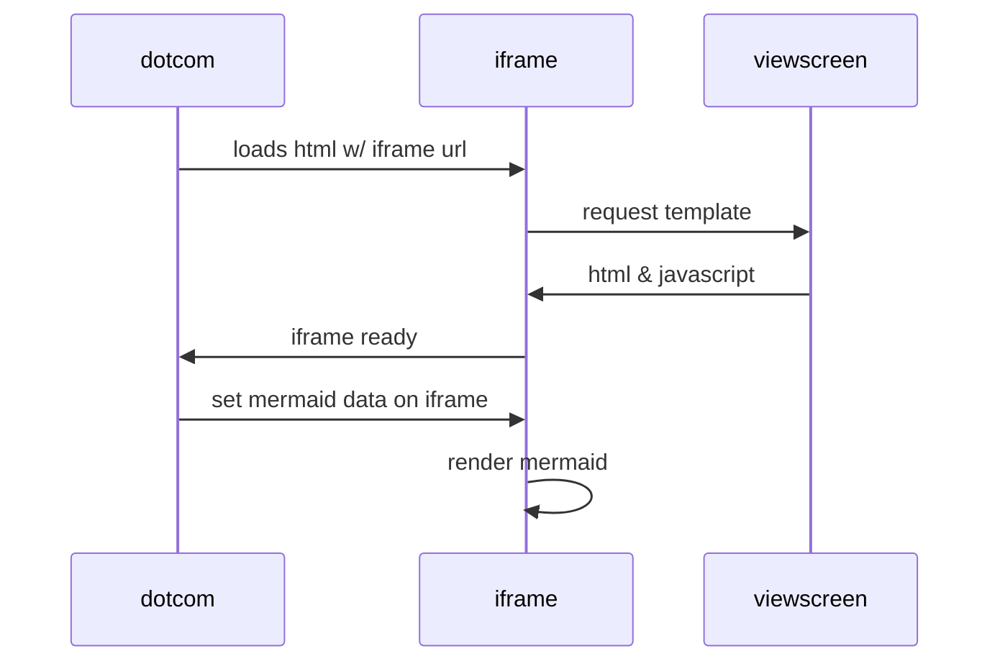
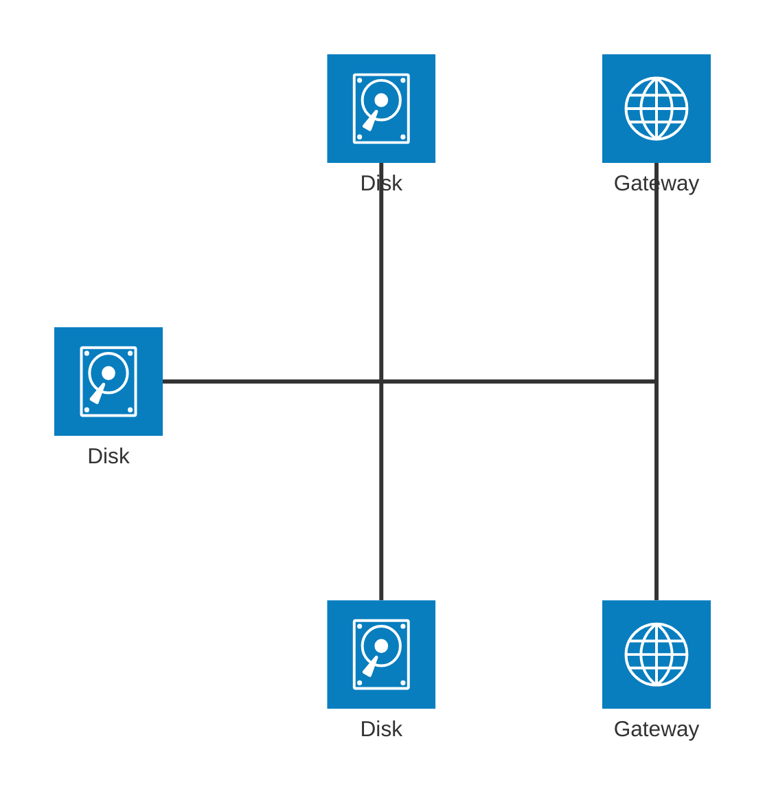

# lab-azure-aws-sso

.AWS IAM identity Provider
image:images/01.aws.iam.identity.provider.png[]

.AWS IAM Role trust policy
image:images/02.aws.iam.role.trust.policy.png[]

link:./script/app.roles.assignments.sh[assign managed identity to application]

link:./terraform/README.md[terraform]

== reference
* https://aws.amazon.com/it/blogs/security/how-to-access-aws-resources-from-microsoft-entra-id-tenants-using-aws-security-token-service/[How to access AWS resources from Microsoft Entra ID tenants using AWS Security Token Service]